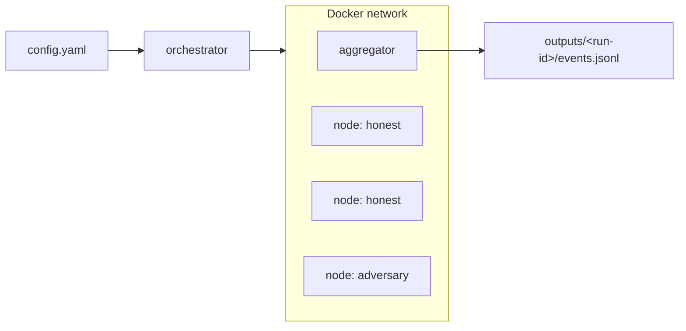

# Eclipse Hivemind

> A test harness for studying eclipse and gradient-poisoning attacks on [Hivemind](https://github.com/learning-at-home/hivemind) decentralized training swarms.

[](https://www.python.org/downloads/)
[](https://github.com/learning-at-home/hivemind)
[](LICENSE)
[](tests/)

Hivemind trains neural networks across untrusted peers that find each other over a
Kademlia DHT and average their gradients with `hivemind.Optimizer`. This project
spins up a swarm of Docker-isolated nodes on one host, drops in adversarial peers,
and records exactly what the swarm did each round and whether gradients were really
averaged, with whom, and what it did to every honest peer's model.

It answers questions like *how many poisoned peers does averaging tolerate?* and
*can a minority isolate a victim inside its own averaging group?* with event logs
you can plot, not just loss curves that hide the mechanism.

---

## Contents

- [How it works](#how-it-works)
- [Requirements](#requirements)
- [Quick start](#quick-start)
- [Running an experiment](#running-an-experiment)
- [Analysing results](#analysing-results)
- [Configuration](#configuration)
- [Node types](#node-types)
- [Project layout](#project-layout)
- [Design decisions](#design-decisions)

## How it works

An **orchestrator** reads a YAML config, creates a Docker bridge network, and
starts one container per node plus an **aggregator**. Each node joins the DHT,
trains a small classifier through `hivemind.Optimizer`, and reports events,
startup, per step metrics, per-round averaging outcomes, held out evaluation, to
the aggregator over HTTP. The aggregator writes every accepted event to
`outputs/<run-id>/events.jsonl`, one JSON object per line, ready for analysis.

Node behaviour lives entirely in the node images, so the orchestrator stays
behaviour lives only in the nodes: an honest node and an adversary differ only in their runner,
selected per node type in the config.



## Requirements

- Python 3.12+
- Docker (the orchestrator drives it through the Docker SDK)
- ~650 MB RAM per node — a 10-node run is comfortable on a laptop

## Quick start

```bash
git clone git@github.com:R0ober/Eclipse-hivemind.git
cd Eclipse-hivemind

python3 -m venv .venv && source .venv/bin/activate
pip install -e .

# Build the node and aggregator images (first build pulls torch + hivemind, ~minutes)
docker build -f docker/node-honest.Dockerfile              -t eclipse-hivemind-node-honest:dev .
docker build -f docker/node-adversary-reverse-gradient.Dockerfile -t eclipse-adversary-reverse-gradient:dev .
docker build -f docker/aggregator.Dockerfile              -t eclipse-hivemind-aggregator:dev .

# Validate a config and run a small all-honest swarm
eclipse-hivemind --config-path configs/all-honest.yaml
```

Results land in `outputs/<run-id>/events.jsonl`.

## Running an experiment

Configs are grouped into experiments under `configs/`. Run a whole sweep and
collect a manifest with one command:

```bash
python scripts/run_experiment.py configs/experiment-1
```

This runs every config in the directory, writes each run's log to
`outputs/experiment-1-logs/`, and records a manifest mapping each config to the
run id it produced. A failed cell is recorded and the sweep continues; re-run with
`--skip-existing` to resume.

The bundled experiments:

| Experiment | Question |
| ---------- | -------- |
| [experiment-1](configs/experiment-1/) | How does gradient reversal scale with the fraction of malicious peers? (0–10 of 10) |
| [experiment-2](configs/experiment-2/) | With strict averaging groups of 5, does the attack isolate individual victims? |
| [experiment-3](configs/experiment-3/) | Reproducibility: rerun experiments 1 and 2 many times and measure how much the numbers move. |

## Analysing results

Turn the raw event logs into tidy CSVs:

```bash
python scripts/summarise_runs.py --manifest outputs/experiment-1-manifest.csv --csv analysis/experiment-1/
```

This writes two files:

- **`runs.csv`** : one row per run: final loss and accuracy, averaging success
  rate, realised group sizes, and integrity columns (did every node start? did
  they share one initial model?).
- **`rounds.csv`** : one row per run, round and node: the full per node time
  series, nothing averaged away.

Install the plotting extras and explore in the notebook:

```bash
pip install -e ".[analysis]"
jupyter lab analysis/experiment-1/analysis.ipynb
```

> **Read `averaging_success_rate` before any loss.** A run where averaging quietly
> stopped is measuring a broken swarm, not a successful attack and the two look
> identical in a loss curve.

## Configuration

A config declares the swarm and the workload. Minimal example:

```yaml
schema_version: 1

experiment:
  name: my-swarm
  seed: 7
  rounds: 20

aggregator:
  endpoint: http://aggregator:8080

node_types:
  normal:
    count: 10
    image: eclipse-hivemind-node-honest:dev
    parameters:
      batch_size: 32
      target_batch_size: 1280   # swarm-wide, not per peer
      matchmaking_time: 10
      averaging_timeout: 30
      step_delay_seconds: 1.0
```

`bootstrap` controls the peer topology and `startup.phases` controls join order,
so adversaries can arrive after the honest network forms. See
[`docs/configuration-reference.md`](docs/configuration-reference.md) for every
field and [`docs/aggregator-api-reference.md`](docs/aggregator-api-reference.md)
for the event schema.

## Node types

Each node type is one image built from its own runner, sharing only the DHT
bootstrap, HTTP client, and log parsing ([ADR 0011](docs/decisions/0011-explicit-node-runner-per-type.md)).

| Node | Behaviour |
| ---- | --------- |
| `honest` | Trains a 4-class quadrant classifier and averages normally. |
| `adversary-reverse-gradient` | Identical to honest, but negates its gradients before averaging to drag the swarm's model toward a worse one. |

Nodes report `averaging_completed` events parsed from Hivemind's own logs, so a run
records whether gradients were *actually* averaged with peers or silently fell back
to local gradients ([ADR 0013](docs/decisions/0013-averaging-evidence-from-hivemind-logs.md)).

## Project layout

```
configs/            experiment configs, grouped by experiment
docker/             Dockerfiles for each node type and the aggregator
docs/
  decisions/        architecture decision records (ADRs)
  *.md              configuration and API reference
scripts/            run sweeps, summarise results, measure resources
src/
  orchestrator/     Docker lifecycle, node environment, backend protocol
  eclipse_hivemind/
    aggregator/     FastAPI event collector + in-memory store
    nodes/          honest/ adversary/ shared/ runners
analysis/           result CSVs and notebooks
tests/              pytest suite
```

## Design decisions

Non-obvious choices are recorded as ADRs in
[`docs/decisions/`](docs/decisions/) covering everything from why the
run id is generated by the orchestrator to why the training task uses four classes
and so on.
[index](docs/decisions/README).

## Development

```bash
pip install -e ".[test]"
pytest
```

## License

[MIT](LICENSE)
